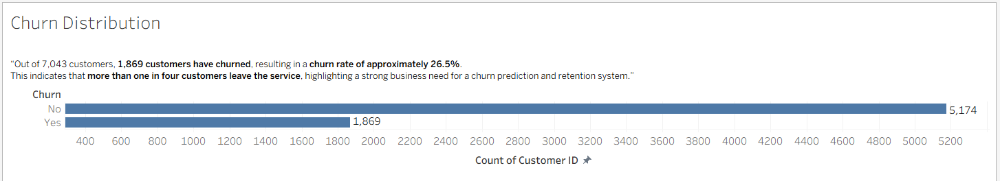
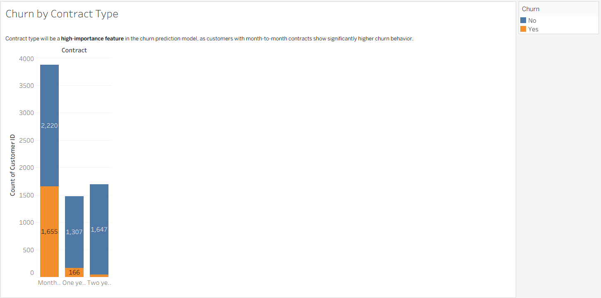
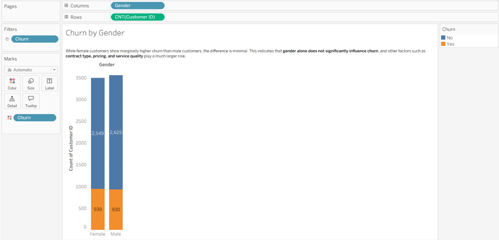
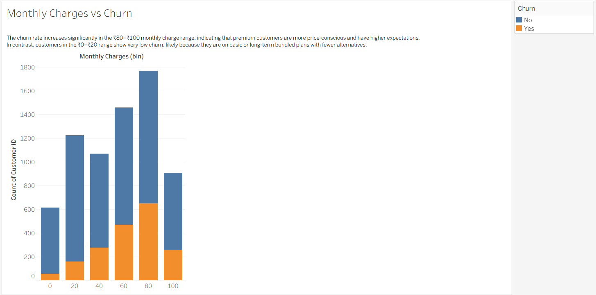

# 📊 Customer Retention Prediction System

## 🔍 Project Overview
Customer retention is a critical challenge for businesses across industries. When customers stop using a service, it leads to revenue loss and impacts long-term growth.

This project focuses on understanding customer data and building a system that can identify customers who are likely to leave a service. The insights gained can help businesses take timely actions to improve retention.

---

## 🎯 Business Problem
Customer churn occurs when customers discontinue a product or service. In many cases, organizations realize this only after the customer has already left.

### Key Challenges:
- Late identification of customer dissatisfaction  
- Revenue loss due to customer exits  
- Difficulty in recognizing churn-prone customers early  

The goal is to detect potential churn in advance so that preventive measures can be taken.

---

## 📂 Dataset Understanding
The dataset used in this project contains information related to telecom customers.

Each row in the dataset represents **one customer**, including:
- 👤 Personal and demographic details  
- 📞 Service subscription information  
- 💳 Billing and account-related details  

The dataset includes a mix of **numerical** and **categorical** columns.

---

## 🎯 Target Variable
The main column of interest is **Churn**:
- **Yes** → Customer has left the service  
- **No** → Customer has continued using the service  

This variable will be used to understand and predict customer retention behavior.

---

## 🗺️ Project Plan
The project will be carried out in the following stages:
1. Dataset understanding and documentation  
2. Data cleaning and preparation  
3. Exploratory data analysis  
4. Model building  
5. Evaluation and insights  

---

## 🗺️ Project Roadmap
| Stage | Task | Status |
|------|------|--------|
| Stage 1 | Data Understanding & Documentation | ✅ Completed |
| Stage 2 | Data Cleaning & EDA | ⏳ Pending |
| Stage 3 | Model Development | ⏳ Pending |
| Stage 4 | Explainability & Deployment | ⏳ Pending |

---

## 📌 Current Status
✅ **Step-1 Completed**  
The dataset has been reviewed, the project structure is set up, and initial documentation has been prepared.

## 📊 Step-1: Exploratory Data Analysis & Visualization (Completed)

### What was done
- Performed exploratory data analysis using Excel
- Analyzed churn patterns using pivot tables
- Created visualizations using Tableau
- Built an interactive dashboard combining key insights

---

### Analysis Performed
- Churn distribution
- Churn vs Contract Type
- Churn vs Internet Service  
- Churn vs Gender  
- Monthly Charges vs Churn  
- Dashboard

---

### Key Findings
- Out of 7,043 customers, 1,869 have churned, resulting in a churn rate of approximately **26.5%**, indicating a significant retention challenge.
- Gender shows minimal influence on churn; differences between male and female customers are marginal.
- Customers using **Fiber Optic** internet services exhibit higher churn, likely due to higher monthly charges and availability of competitive alternatives.
- **Month-to-month contract** customers show significantly higher churn and will be a high-importance feature in the prediction model.
- Churn increases notably in the **₹80–₹100 monthly charge range**, suggesting higher price sensitivity among premium customers.
- Customers in the **₹0–₹20 charge range** show very low churn, likely due to basic or long-term bundled plans with fewer alternatives.

---

### Visual Outputs
The following charts were created during analysis:
- Churn distribution

- Churn by contract type

- Churn by internet service

- Churn by gender

- Monthly charges vs churn

- Dashboard

---

### Outcome of Step-1
- Identified key churn drivers
- Validated business assumptions before model building
- Prepared data for feature engineering and machine learning

---

### Next Steps
➡️ Data cleaning, feature engineering, and model development

---

