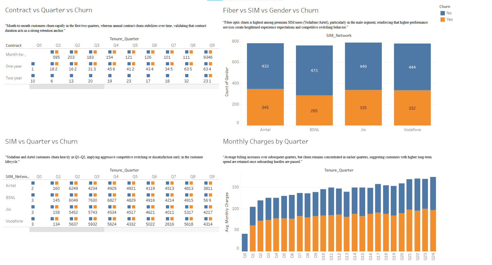
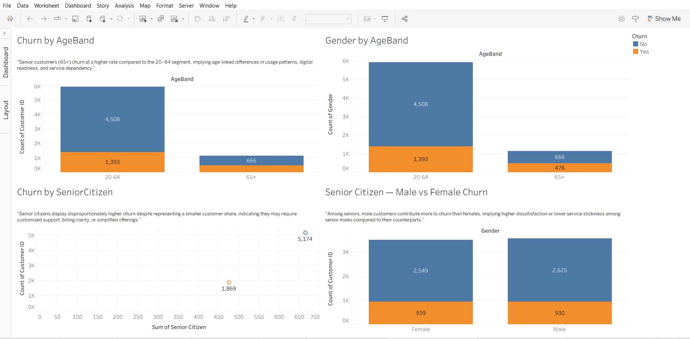
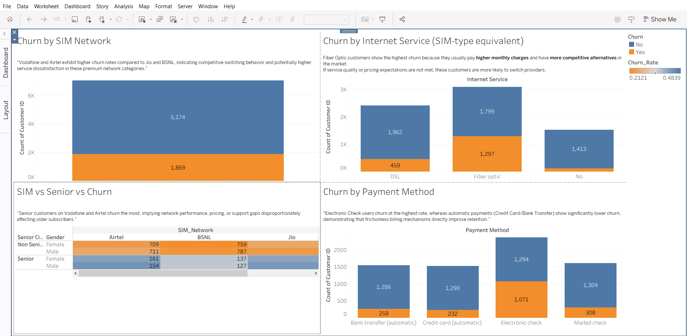
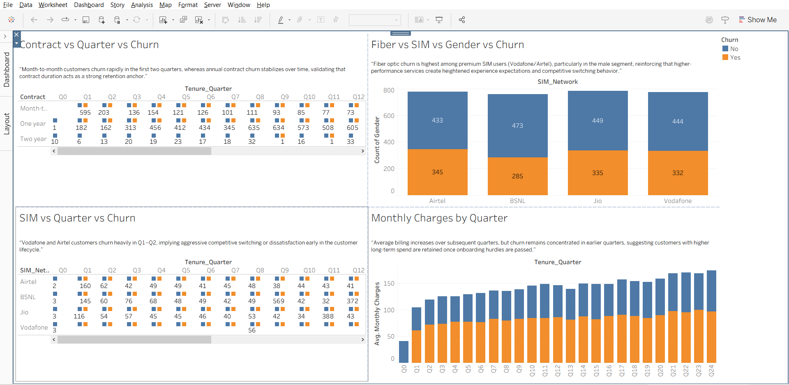

# 📊 Customer Retention Prediction System

## 🔍 Project Overview
Customer retention is a critical challenge for businesses across industries. When customers stop using a service, it leads to revenue loss and impacts long-term growth.

This project focuses on understanding customer data and building a system that can identify customers who are likely to leave a service. The insights gained can help businesses take timely actions to improve retention.

---

## 🎯 Business Problem
Customer churn occurs when customers discontinue a product or service. In many cases, organizations realize this only after the customer has already left.

### Key Challenges:
- Late identification of customer dissatisfaction  
- Revenue loss due to customer exits  
- Difficulty in recognizing churn-prone customers early  

The goal is to detect potential churn in advance so that preventive measures can be taken.

---

## 📂 Dataset Understanding
The dataset used in this project contains information related to telecom customers.

Each row in the dataset represents **one customer**, including:
- 👤 Personal and demographic details  
- 📞 Service subscription information  
- 💳 Billing and account-related details  

The dataset includes a mix of **numerical** and **categorical** columns.

---

## 🎯 Target Variable
The main column of interest is **Churn**:
- **Yes** → Customer has left the service  
- **No** → Customer has continued using the service  

This variable will be used to understand and predict customer retention behavior.

---

## 🗺️ Project Plan
The project will be carried out in the following stages:
1. Dataset understanding and documentation  
2. Data cleaning and preparation  
3. Exploratory data analysis  
4. Model building  
5. Evaluation and insights  

---

## 🗺️ Project Roadmap
| Stage | Task | Status |
|------|------|--------|
| Stage 1 | Data Understanding & Documentation | ✅ Completed |
| Stage 2 | Data Cleaning & EDA | ⏳ Pending |
| Stage 3 | Model Development | ⏳ Pending |
| Stage 4 | Explainability & Deployment | ⏳ Pending |

---

## 📌 Current Status
✅ **Step-1 Completed**  
The dataset has been reviewed, the project structure is set up, and initial documentation has been prepared.

## 📊 Step-1: Exploratory Data Analysis & Visualization (Completed)

### What was done
- Performed exploratory data analysis using Excel
- Analyzed churn patterns using pivot tables
- Created visualizations using Tableau
- Built an interactive dashboard combining key insights

---

### Analysis Performed
- Churn distribution
- Churn vs Contract Type
- Churn vs Internet Service  
- Churn vs Gender  
- Monthly Charges vs Churn  
- Dashboard

---

### Key Findings
- Out of 7,043 customers, 1,869 have churned, resulting in a churn rate of approximately **26.5%**, indicating a significant retention challenge.
- Gender shows minimal influence on churn; differences between male and female customers are marginal.
- Customers using **Fiber Optic** internet services exhibit higher churn, likely due to higher monthly charges and availability of competitive alternatives.
- **Month-to-month contract** customers show significantly higher churn and will be a high-importance feature in the prediction model.
- Churn increases notably in the **₹80–₹100 monthly charge range**, suggesting higher price sensitivity among premium customers.
- Customers in the **₹0–₹20 charge range** show very low churn, likely due to basic or long-term bundled plans with fewer alternatives.

---

## 📊 Visual Outputs & Dashboard Analysis

To ensure clarity and avoid visual clutter, the analysis was structured into **four Tableau dashboards**, each designed to answer a **specific business question related to customer churn**.

---

### 📌 Dashboard 1 — Churn Overview Dashboard

**Contains:**
- Churn Distribution  
- Churn by Gender  
- Churn by Internet Service  
- Churn by Contract Type  
- Monthly Charges vs Churn  

**Purpose:**  
→ Provides a high-level overview of churn behavior and helps identify the primary churn drivers across key customer attributes.

*“Churn is significantly higher among month-to-month customers, fiber optic internet users, and customers with higher monthly charges. Gender plays a minimal role. These findings indicate that contract freedom, premium product expectations, and price sensitivity are primary churn drivers at the overall population level.”*

---

### 📌 Dashboard 2 — Demographic Churn Dashboard

**Contains:**
- Churn by Age Band  
- Gender Distribution by Age Band  
- Churn by Senior Citizen Status  
- Senior Citizen Churn (Male vs Female)  

**Purpose:**  
→ Identifies churn patterns across different demographic segments, helping understand how age and senior citizen status influence customer retention.

*“Demographic analysis shows that churn does not vary significantly by gender, but senior citizens exhibit a notably higher churn rate than non-seniors, particularly senior males. This indicates that age and digital readiness influence churn more than gender. Senior customers may need targeted engagement, support, and simplified service touchpoints.”*

---

### 📌 Dashboard 3 — Product & SIM Churn Dashboard

**Contains:**
- Churn by SIM Network  
- SIM Network vs Gender  
- SIM vs Senior Citizen vs Churn (Heatmap)  
- Churn by Payment Method  
- Fiber vs SIM vs Gender vs Churn  

**Purpose:**  
→ Analyzes churn based on product usage, network type, and payment preferences to uncover service-related churn trends.

*“Product-level analysis reveals that premium service subscribers (e.g., fiber optic, higher billing) and customers using manual billing methods (such as electronic check) churn more frequently. Simulated SIM analysis also indicates competitive switching tendencies, especially among premium network customers. This confirms that churn is driven not just by price, but by perceived service value, experience expectations, and billing friction.”*

---

### 📌 Dashboard 4 — Tenure & Customer Lifecycle Dashboard

**Contains:**
- Churn by Tenure Quarter  
- Average Charges by Tenure Quarter  
- SIM Network vs Tenure Quarter (Heatmap)  
- Fiber Service vs Tenure Quarter  
- Contract Type vs Tenure Quarter (Heatmap)  

**Purpose:**  
→ Helps understand **when churn occurs** during the customer lifecycle and how tenure, charges, and contract types impact churn over time.

*“Churn is heavily front-loaded, peaking in the first 1–2 quarters of tenure, and stabilizing in later quarters. Month-to-month users are especially prone to early churn, whereas long-term contract customers remain stable. Lifecycle churn patterns confirm that onboarding experience, initial service satisfaction, and expectation alignment during early months are critical levers for improving retention.”*

### Outcome of Step-1
From Excel analysis and Tableau dashboard, the following insights were observed:
- Month-to-month contract customers churn the most
- Fiber optic internet users show higher churn rates
- Customers with higher monthly charges are more likely to churn
- Early-tenure customers are at higher risk of leaving
- Payment method plays a role, with electronic check users showing higher churn
- Gender shows minimal influence on churn behavior

The extended EDA and visualization phase demonstrated that customer churn is:
- Segmentable (specific high-risk cohorts exist)
- Predictable (drivers show clear patterns)
- Actionable (interventions can be targeted)

These insights validate that machine learning is meaningful for this use case and directly support feature engineering and model design in Step 2.

---

### Next Steps
➡️ Data cleaning, feature engineering, and model development

---
